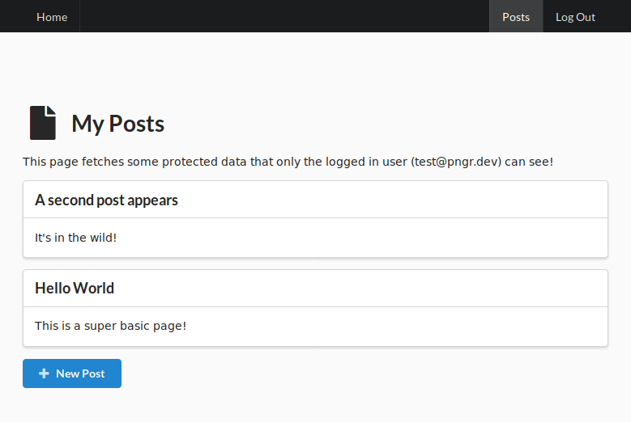

# Stack 🏓

Dockerized (postgres + nginx + golang + react) starter kit

Only implements `users`, `sessions`, `password_resets`, and a toy `post` type to demonstrate basic CRUD. PNGR is _not_ a CMS.

## Features and Stack

- Hot-reload, front and back, including a test-runner for golang changes

### Back-end
- [golang-migrate](https://github.com/golang-migrate/migrate) already configured for easy migrations
- [sqlc](https://github.com/kyleconroy/sqlc) for auto-generated sql bindings
- [golang-jwt](https://github.com/golang-jwt/jwt) cookies with automatic refresh: ready for horizontal 

### Front-end
- [React](https://react.dev/) dev server
- [React Router](https://github.com/ReactTraining/react-router) for [front-end routing](./react/src/Routes/Routes.js)
- [React Context](https://reactjs.org/docs/context.html) for global user state
- [Semantic UI React](https://react.semantic-ui.com/) for component library with functional [theme variables](https://github.com/Semantic-Org/Semantic-UI/blob/master/src/themes/default/globals/site.variables) and hot-reload


## Requirements
Install `docker` && `docker-compose`

## Quick Start
```bash
# clone the repo
git clone https://github.com/karlkeefer/pngr.git my_project_name

# copy the .env template for your local version
cp .env.example .env

# build and start the containers
docker-compose up
```
1) Visit `http://localhost:4500`
2) Make changes to go, sql, or react code, and enjoy hot-reload goodness!



## Run client-side test watcher
```bash
docker-compose exec react npm run test
```

## Database Helpers

### Migrations
Migrations are created and run using simple wrappers around [go-migrate](https://github.com/golang-migrate/migrate).

```bash
# create files for a new migration
postgres/new my_migration_name

# execute any new migrations (this is also run automatically the container is created)
postgres/migrate up

# go down 1 migration
postgres/migrate down 1

# goto a migration by index
postgres/migrate goto 3
```

### Open a psql client
```bash
# remember to use \q to exit
postgres/psql
```